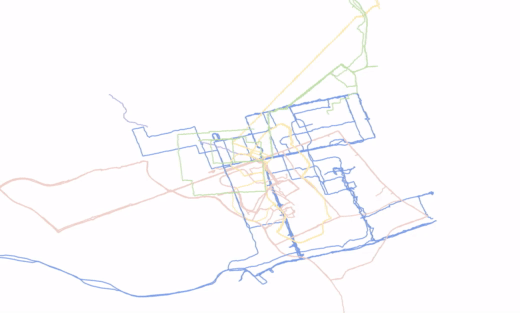

# Cities on Strava

Can you guess what cities I've Strava'ed in?

Create a Strava app by following instructions [here](https://developers.strava.com/docs/getting-started/#account).

Replace YOURCLIENTID with the Client ID found in your [Strava API Application details](https://www.strava.com/settings/api): 

`https://www.strava.com/oauth/authorize?client_id=YOURCLIENTID&response_type=code&redirect_uri=http://localhost/exchange_token&approval_prompt=force&scope=read,activity:read`

Paste the above URL in your browser URL navigation bar.

Click Authorize. You should be redirected to a link that looks like this: 

`http://localhost/exchange_token?state=&code=4289e16524718004f9e4f03de333f9a44e7d2b15&scope=read,activity:read`

In the URL, copy the value between `code=` and `&scope`. Use this value as your auth_token in draw.ipynb or draw.py (whichever you prefer). This code is valid for 6 hours. Paste in your client_id and client_secret found in your API Application details.